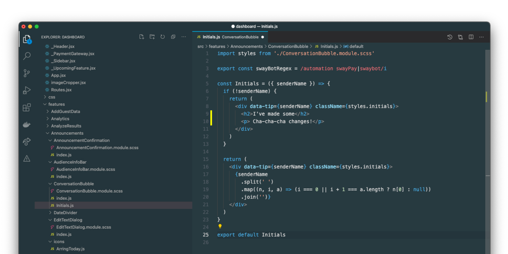

# Sombra

Sombra is a minimal, dark and easy-on-the-eyes theme for Visual Studio code. It consists of the tweakings I've done on my VSCode user settings for years until I feel happy with it.

Download from Visual Studio Marketplace: https://marketplace.visualstudio.com/items?itemName=wunnle.sombra
