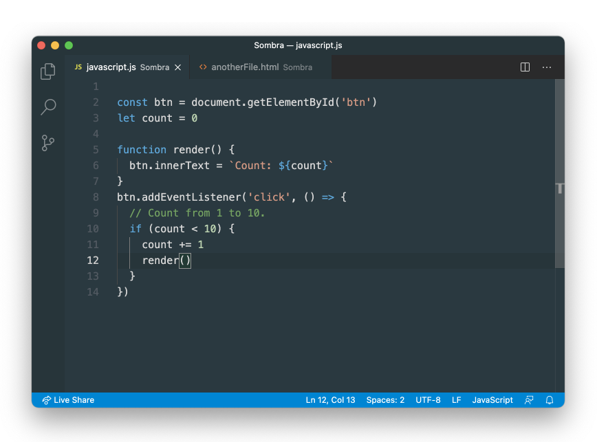
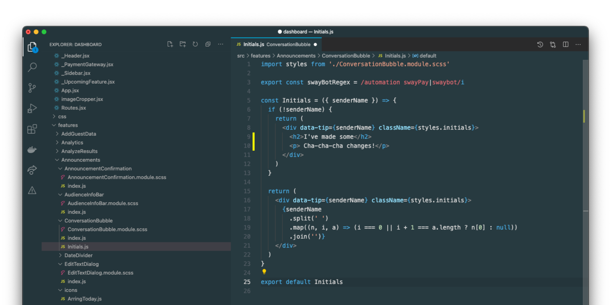

# Sombra

Sombra is a dark, mimimal and easy-on-the-eyes theme for Visual Studio Code. It consists of the tweakings I've done on my VSCode user settings for years until I felt happy with it.

Download from Visual Studio Marketplace: https://marketplace.visualstudio.com/items?itemName=wunnle.sombra
